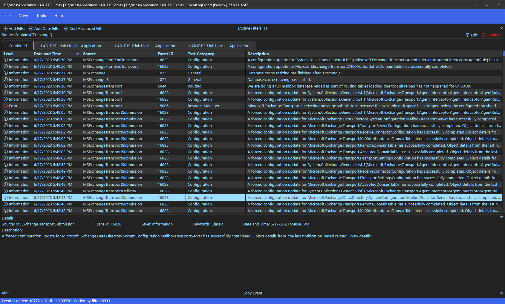

# EventLogExpert

A Windows Event Log viewer for tech support and IT professionals.

## Key features

* Quickly load huge .evtx files. File -> Open and select multiple files, or just drag-and-drop them into the view. The tool will happily load multiple .evtx files concurrently.
* View multiple .evtx files in an interleaved combined view and examine how events line up across multiple servers.
* See event description previews right in the table without having to open each individual event.
* Filter using friendly drop-downs, use Advanced Filter and enter a LINQ expression, or combine both.
* Create an event database to view .evtx files on computers that don't have the same product installed. For example, view Exchange Server or SQL Server logs on a user workstation.
* Can be used as a replacement for Event Viewer to view live event logs. Choose Continuously Update on the View menu and watch new events appear in real time.

For more information, check our [docs](docs/Home.md).

## Quick Start

### Windows 10 or 11, or Server 2022

Simply download the `EventLogExpert*.msix` file from the latest and run it: [https://github.com/microsoft/EventLogExpert/releases/latest/](https://github.com/microsoft/EventLogExpert/releases/latest/).

### Windows 2019

* Download the `EventLogExpert*.msix`.
* Windows 2019 will also need the `Microsoft.WindowsAppRuntime*.msix` unless it was already installed by something else. You'll find this file in the release with the `EventLogExpert*.msix`.
* Enable sideloading:

    `Set-ItemProperty -Path HKLM:\SOFTWARE\Microsoft\Windows\CurrentVersion\AppModelUnlock -Name AllowAllTrustedApps -Value 1`

* Install the runtime with Add-AppxPackage. Example:

    `Add-AppxPackage $home\Downloads\Microsoft.WindowsAppRuntime.1.2.msix`

* Install EventLogExpert:

    `Add-AppxPackage $home\Downloads\EventLogExpert_23.5.19.1256_x64.msix`

### First time setup

Head over to our [docs](docs/Home.md).

## Contributing

This project welcomes contributions and suggestions.  Most contributions require you to agree to a
Contributor License Agreement (CLA) declaring that you have the right to, and actually do, grant us
the rights to use your contribution. For details, visit https://cla.opensource.microsoft.com.

When you submit a pull request, a CLA bot will automatically determine whether you need to provide
a CLA and decorate the PR appropriately (e.g., status check, comment). Simply follow the instructions
provided by the bot. You will only need to do this once across all repos using our CLA.

This project has adopted the [Microsoft Open Source Code of Conduct](https://opensource.microsoft.com/codeofconduct/).
For more information see the [Code of Conduct FAQ](https://opensource.microsoft.com/codeofconduct/faq/) or
contact [opencode@microsoft.com](mailto:opencode@microsoft.com) with any additional questions or comments.

## Trademarks

This project may contain trademarks or logos for projects, products, or services. Authorized use of Microsoft 
trademarks or logos is subject to and must follow 
[Microsoft's Trademark & Brand Guidelines](https://www.microsoft.com/en-us/legal/intellectualproperty/trademarks/usage/general).
Use of Microsoft trademarks or logos in modified versions of this project must not cause confusion or imply Microsoft sponsorship.
Any use of third-party trademarks or logos are subject to those third-party's policies.
