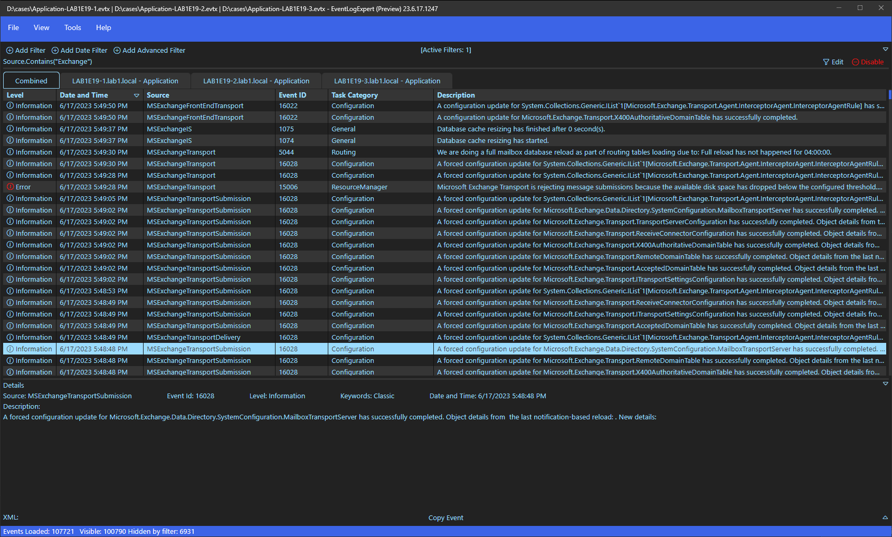

# EventLogExpert

A Windows Event Log viewer for tech support and IT professionals.



## Key features

* Loads `.evtx` files concurrently — `File` → `Open`, drag-and-drop, or open every `.evtx` in a folder in one step.
* Combined view interleaves events from any mix of file and live logs by time across multiple machines.
* Configurable event-table columns (visibility, ordering, sort) with per-row highlight colors driven by your filters.
* Filter pane with Basic (category × evaluator) filters, predicates joined with `AND` / `OR`, Date filter, Advanced Dynamic LINQ expressions, and Exclusion filters.
* Filter Cache (Favorites + Recent) and named, importable / exportable Filter Groups.
* Live event channels with auto-discovery (admin-only channels disabled when not elevated), `Continuously Update`, and a `Load New Events` buffered mode.
* Provider Databases — load `.db` files captured on another machine so its `.evtx` files resolve descriptions and task categories correctly.
* In-line description previews in the table; on-demand event XML in the Details pane.
* Configurable Ctrl+C copy mode (`Default`, `Simple`, `XML`, `Full`); System / Light / Dark theme.
* In-app Release Notes and Debug Log viewer; opt-in pre-release update channel.

For more information, check our [docs](docs/Home.md).

## Quick Start

Download the `EventLogExpert_<version>_x64.appinstaller` (or the matching `EventLogExpert_<version>_x64.msix`) from the latest release and run it: <https://github.com/microsoft/EventLogExpert/releases/latest>.

The `.appinstaller` declares its dependency on the Windows App Runtime (currently `Microsoft.WindowsAppRuntime.1.7.msix`, also published in the same release) so App Installer fetches the runtime automatically on a clean machine. Updates are checked on launch.

If you'd rather install the runtime manually first, grab `Microsoft.WindowsAppRuntime.1.7.msix` from the release and install it with:

```
Add-AppxPackage $home\Downloads\Microsoft.WindowsAppRuntime.1.7.msix
```

Then install the app:

```
Add-AppxPackage $home\Downloads\EventLogExpert_<version>_x64.msix
```

### First time setup

Head over to our [docs](docs/Settings.md).

## Contributing

This project welcomes contributions and suggestions.  Most contributions require you to agree to a
Contributor License Agreement (CLA) declaring that you have the right to, and actually do, grant us
the rights to use your contribution. For details, visit https://cla.opensource.microsoft.com.

When you submit a pull request, a CLA bot will automatically determine whether you need to provide
a CLA and decorate the PR appropriately (e.g., status check, comment). Simply follow the instructions
provided by the bot. You will only need to do this once across all repos using our CLA.

This project has adopted the [Microsoft Open Source Code of Conduct](https://opensource.microsoft.com/codeofconduct/).
For more information see the [Code of Conduct FAQ](https://opensource.microsoft.com/codeofconduct/faq/) or
contact [opencode@microsoft.com](mailto:opencode@microsoft.com) with any additional questions or comments.

## Trademarks

This project may contain trademarks or logos for projects, products, or services. Authorized use of Microsoft 
trademarks or logos is subject to and must follow 
[Microsoft's Trademark & Brand Guidelines](https://www.microsoft.com/en-us/legal/intellectualproperty/trademarks/usage/general).
Use of Microsoft trademarks or logos in modified versions of this project must not cause confusion or imply Microsoft sponsorship.
Any use of third-party trademarks or logos are subject to those third-party's policies.
