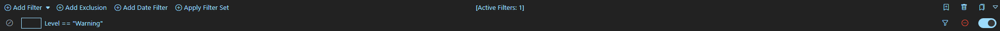

# [EventLogExpert](Home.md)

## Filtering

The Filter pane sits above the event table. Every event in the active log set is evaluated against the applied filters; non-matches are hidden.

<!-- screenshot: filter-pane -->


The pane header carries the row-adding actions on the left and the persistence / management actions on the right:

| Left-side action | Adds |
| --- | --- |
| `Add Filter` (split button, primary action) | A property × operator × value Basic comparison against a single resolved-event field. |
| `Add Filter` chevron → `Basic` | Same as the primary action. |
| `Add Filter` chevron → `Advanced` | A free-form filter expression evaluated against `ResolvedEvent` by the app's built-in filter parser. |
| `Add Filter` chevron → `Recent` | A `Cached` filter row pre-populated from the filter library's favorites / recent strings. Disabled when no recents are available; the menu lists the actual reason in its disabled tooltip (`Filter library failed to load. Open Filter Library to retry.`, `Filter library is still loading. Please try again.`, or `No recent filters yet — apply a Basic or Advanced filter to populate.`). A filter row's in-line mode dropdown follows the same rule — `Recent` is only offered as a switch-to option once at least one favorite or recent filter exists (a row already in `Recent` mode keeps showing it so it stays editable). |
| `Add Exclusion` | A Basic filter row in the excluded state — same property × operator × value shape as `Add Filter` → `Basic`, but matching events are hidden instead of shown. Any saved row can be flipped between included and excluded later via the chrome `Exclude` / `Include` button. |
| `Add Date Filter` | A `Before` / `After` time-window filter. Only one date filter exists at a time; the button is hidden once one is added. |
| `Apply Filter Set` | Opens an inline picker (dropdown of every saved filter set in the library). Picking one and clicking `Apply` adds that set's filters to the current pane. When any filter set carries **tags**, the picker also shows a multi-select **tag dropdown** ("All tags" until you pick some) that narrows the list to sets carrying *all* selected tags; it's hidden when no set is tagged, and the currently-selected set stays available even if it doesn't match. When the library has no filter sets yet, the picker shows one of two empty-state messages pointing the user at `Save as Filter Set` on the right — the wording shifts slightly depending on whether the pane currently has filters worth saving. |

Each saved row carries a chrome strip with `Edit`, `Exclude` (or `Include` when the row is already an exclusion), `Remove`, and a `Disable` / `Enable` toggle. While editing, the chrome shows `Save` and `Cancel`. Non-exclusion rows also show a highlight-color picker (`Highlight Color`) before the comparison content. When any filter is being applied, the pane shows `[Applying Filters]` with a spinner; otherwise it shows `[Active Filters: N]`. The pane can be collapsed via the caret in the top-right corner.

The pane header's right-side icon strip carries three persistence and management actions:

| Icon | Action | Behavior |
| --- | --- | --- |
| Bookmark-plus | `Save as Filter Set` | Prompts for a name (default `New Filter Set`) and saves the current filter rows as a new filter set in the library. The date filter is not included. Active tooltip: `Save as Filter Set...`; disabled tooltip: `No filters to save` (plus a screen-reader hint `Add a filter before saving as a Filter Set.`). |
| Trash | `Clear All Filters` | Shows a confirmation with the count of items being removed, then drops every filter row, the date filter, and any pending drafts. Active tooltip: `Clear All Filters...`; disabled tooltip: `No filters to clear`. |
| Bookmarks | `Open Filter Library` | Opens the [Filter Library modal](Saved-Filters.md). Tooltip: `Open Filter Library`. |

`View` → `Show All Events` (`Ctrl+H`) suspends inclusion-filter evaluation without removing any filters. Exclusions and the date filter remain in effect when it's on.

### Basic filters

Pick a property, pick an operator, then enter or pick a comparison value. Optionally add one or more predicates joined to the parent with `AND` or `OR`.

**Properties** (`EventProperty`):

| Label | Source field |
| --- | --- |
| `Event ID` | event id (int) |
| `Activity ID` | activity id GUID (string-equal) |
| `Level` | resolved level string (`Information`, `Warning`, `Error`, `Critical`, `Verbose`) |
| `Keywords` | display keywords |
| `Source` | provider name |
| `Task Category` | resolved task name |
| `Process ID` | process id |
| `Thread ID` | thread id |
| `User ID` | SID string |
| `Description` | resolved description text |
| `Xml` | raw XML (forces eager XML resolution; see caveat) |

**Operators** (`ComparisonOperator` × `MatchMode`):

| Label | Behavior |
| --- | --- |
| `Equals` | Exact match. Numeric for ID-typed fields; case-sensitive string compare for everything except `Keywords`, which is case-insensitive. |
| `Contains` | Case-insensitive substring match. |
| `Not Equal` | Negated `Equals` (same case-sensitivity rules). |
| `Not Contains` | Negated `Contains` (case-insensitive). |
| `Multi Select` | The same row in `MatchMode.Many` paired with the `Equals` operator — matches any value in the supplied set. The property determines which set is offered (e.g., `Level` → checkboxes for the five level values; `Source` → the providers seen in the active logs). `Not Equal` does not have a multi-select variant in the picker. |

Predicates live underneath the parent and can be combined freely. `AND` requires the predicate to also match; `OR` matches if either the parent or the predicate matches.

### Date filter

`After` / `Before` timestamps in the configured time zone (see [Settings](Settings.md) → `Time Zone`). Only one date filter is allowed; removing it lets `Add Date Filter` reappear. Right-clicking an event in the table and choosing `Exclude Events Before` / `Exclude Events After` is a shortcut that sets a date filter using the right-clicked event's timestamp as the boundary.

### Advanced filters

Free-form expression evaluated against the `ResolvedEvent` record by the app's built-in filter parser. The syntax is a subset of C# expressions — identifier access, method calls (`.Contains("...")`, `.ToString()`, etc.), `==` / `!=` / `<` / `<=` / `>` / `>=`, `&&`, `||`, `!`, with standard C# operator precedence. The placeholder shown in the input is:

```
(Id == 1000 || Id == 1001) && Description.Contains("Fault")
```

Available properties:

| Property | Type | Notes |
| --- | --- | --- |
| `Id` | `int` | Event id. |
| `ActivityId` | `Guid?` | Nullable. |
| `Level` | `string` | `Information`, `Warning`, `Error`, `Critical`, `Verbose`. |
| `Keywords` | `IReadOnlyList<string>` | Use `.Contains("...")`. |
| `KeywordsDisplayName` | `string` | Comma-separated keywords. |
| `Source` | `string` | Provider name. |
| `TaskCategory` | `string` | |
| `ProcessId` | `int?` | |
| `ThreadId` | `int?` | |
| `UserId` | `SecurityIdentifier?` | Use `.ToString()` to compare. |
| `TimeCreated` | `DateTime` | The raw `ResolvedEvent` value — the table and Details pane render it in the configured time zone, but expressions see the underlying value. |
| `LogName` | `string` | Source log channel as reported by the event reader. |
| `OwningLog` | `string` | The file path or live-channel name as displayed in the tab strip. |
| `LogPathType` | `LogPathType` | `File` or `Channel`. |
| `ComputerName` | `string` | |
| `RecordId` | `long?` | |
| `Description` | `string` | Resolved description text. |
| `Xml` | `string` | Raw event XML. **See XML caveat.** |

**XML caveat.** When a filter expression references `Xml`, the underlying `EventLogReader` is opened with XML rendering enabled, which is meaningfully slower than the default. Adding an XML-referencing filter against logs already loaded without XML triggers a one-time re-read of those logs (only the logs that lack XML — logs already loaded with XML are untouched). Removing or disabling an XML filter does not trigger another reload because the in-memory XML is harmless to keep. Filters that don't reference `Xml` operate on already-resolved fields and stay fast.

### Excluded filters

Either an `Add Exclusion` row from the start, or any Basic / Advanced row toggled with the `Exclude` chrome button. Matching events are hidden. Excluded filters are evaluated independently of `View` → `Show All Events`: the show-all toggle disables only the inclusion side, so exclusions and the date filter remain in effect when it's on. The pane header's `Clear All Filters` icon (trash) removes every filter from the pane (including the date filter and exclusions) — there's no built-in way to reversibly suspend everything at once.

### Recent / Cached filters

Quick-access strings for repeat use. The `Add Filter` chevron's `Recent` item creates a Cached-mode row pre-populated from the filter library's favorites and recent entries; both the chevron menu and a row's in-line mode dropdown only offer `Recent` once at least one favorite or recent filter exists. When the favorites/recents feeding a Recent row carry **tags**, the row also shows a multi-select **tag dropdown** (shows "All tags" until you pick some) that narrows the Recent options to entries carrying *all* selected tags. The tag dropdown is hidden when none of those entries are tagged, your current pick stays available even if it doesn't match the chosen tags, and untagged recents drop out of the list once any tag is selected. The library itself (favorites, previously-used auto-tracked rows, and what the `Apply Filter Set` picker offers) is managed from the [Filter Library modal](Saved-Filters.md).

### Highlighting

Each non-excluded filter row exposes a `Highlight Color` picker in its chrome. When set, every event matching that filter is rendered with that background color in the event table. When multiple filters with different colors match the same event, the first matching enabled, non-excluded filter in pane order wins (a filter with `Highlight Color` set to `None` still counts as a match and suppresses any later highlight). Selection styling beats highlight while a row is selected. Highlight colors persist with the filter — saving a filter set preserves its colors.

[Docs home](Home.md)
