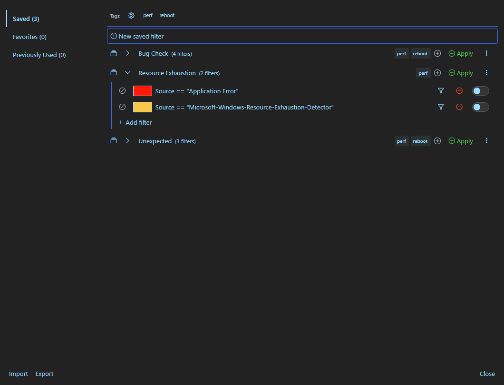

# [EventLogExpert](Home.md)

## Saved Filters — the Filter Library

The Filter Library is the single persisted surface for filter reuse. It replaces the saved-filter modals that earlier builds called the "filter cache" and "filter groups".

Open it from the [Filter pane](Filtering.md) header — the bookmarks icon labeled `Open Filter Library`. When the library fails to load or is still loading, the filter pane's `Recent` menu item and the `Apply Filter Set` picker surface guidance pointing back to this same button (the library does not auto-open from those flows).

<!-- screenshot: filter-library-saved -->

### Modal layout

The modal has three tabs along the left side. Each tab shows its current item count:

| Tab | What it lists |
| --- | --- |
| `Saved` | User-saved entries that you created or imported. Single filters move to the `Favorites` tab when you star them; filter sets always stay here because they can't be favorited. |
| `Favorites` | Single filters you have starred — whether you saved them manually or starred them off the `Previously Used` tab. Filter sets are never on this tab; they aren't favoritable. |
| `Previously Used` | Auto-tracked entries: filters that were applied recently but never explicitly saved to the library. Capped at 50 entries, ordered by most-recent use. Each row carries a `Tracked` badge and a relative timestamp (`just now`, `5m ago`, `3h ago`, `2d ago`, or the ISO date when more than a week old). |

When the active tab is empty, the modal shows one of four messages:

- Saved: `No saved filters or filter sets yet. Use "Save as Filter Set" from the filter pane.`
- Favorites: `No favorited filters or filter sets yet. Star an entry to add it here.` (the UI string mentions filter sets for symmetry, but only single filters can actually be starred — see the Favorites row above)
- Previously Used: `No filters have been applied recently.`
- When any tag filter is selected and no entries match: `No entries match the selected tags.` (overrides the per-tab message above on any tab).

Above the entries on every tab, when the library has any tags, a tag filter bar appears:

- A `Manage tags` gear toggles an inline `Tag management` panel where every tag can be renamed or deleted. Renaming to a tag that already exists prompts a confirmation to merge the two: confirming re-tags every entry currently carrying the renamed tag and then drops the now-empty source tag; cancelling leaves both tags unchanged. Delete prompts a separate confirmation naming the affected entry count. A search input appears at the top of the panel once the library has six or more tags, filtering its row list as you type.
- Up to 10 tag chips are visible by default; remaining tags collapse into a `+N more` overflow button that expands them in place. The same button reads `− less` while expanded.
- Clicking a chip toggles it on or off as an AND-filter for the active tab. Selected tags persist per-tab while the modal is open.

### Entries

Every row begins with a kind icon — a collection icon for filter sets, a funnel for single filters — followed by the entry name and a per-kind detail (`(N filters)` for a filter set, the `Tracked` badge plus relative time on Previously Used).

#### Row chrome (all tabs)

| Control | Behavior |
| --- | --- |
| Expand chevron (filter sets only) | Opens an inline editor under the row showing every filter in the set, each with the same chrome the filter pane uses (toggle enable/disable, edit, save, remove, highlight color). An `Add filter` button at the bottom of the editor appends a new filter to the set. |
| Tag chips + `+` button | Inline tag management. Up to 2 chips show inline with `×` remove buttons; `+N more` flips the row into tag-edit mode (a tag picker showing every existing tag) so you can add or remove tags. The lone `+` button (when there are no tags) is the same affordance — it opens the tag picker so you can add the first tag. |
| `Apply` (green `+`) | Adds the entry's filters to the current filter pane. The merge deduplicates by lower-cased comparison text, filter mode (Basic vs Advanced), and include/exclude flag — so a filter already in the pane on those three axes is skipped. The modal closes afterwards. Existing pane filters are not touched. |
| Star (single filters only) | Toggles favorite status. Starred filters appear on the Favorites tab; unstarring drops them back to whichever tab matches their origin. Filter sets are not favoritable. |
| Three-dots (`More actions`) | Opens the per-entry menu — see below. |

#### Per-entry `More actions` menu

| Item | When shown | Behavior |
| --- | --- | --- |
| `Replace current filters` | Always | Clears every filter from the pane, then applies this entry's filters. The date filter and any in-progress filter drafts are preserved. A confirmation prompt fires when the pane already has filters. The modal closes after applying. |
| `Save to Library` | Auto-tracked, non-favorite entries (Previously Used tab) | Promotes the auto-tracked row to a user-saved entry. The row moves from Previously Used to Saved. |
| `Add to filter set...` | Single filters only | Sub-menu listing every existing filter set plus a `+ New filter set...` item. Picking an existing set adds this filter to it; picking the new-set item prompts for a name (default `New Filter Set`) and creates the set with this filter as its first member. |
| `Rename...` | User-saved entries only | Prompts for a new name with duplicate-name validation against entries of the same kind (a saved filter and a filter set may share a name). Auto-tracked entries don't expose this — their identity is the underlying filter. |
| `Export...` | Filter sets only | Saves the single filter set (name + filters + tags) as a JSON file. Single filters can be exported via the library-level `Export` only. |
| `Delete` | Always | Removes the entry. Filter sets and user-saved single filters confirm first; auto-tracked single filters delete without a prompt. |

### Saved tab — creating a new saved filter inline

The Saved tab has a `New saved filter` button at the top. Click it to expand an inline draft form:

- A name input with duplicate-name validation against existing saved filters.
- A filter draft editor (defaults to Advanced mode) — same chrome as the filter pane.
- A tag picker with suggestions from the library's existing tags.

`Save` writes the entry to the library and collapses the form; `Cancel` discards.

This is an alternative to building the filter in the pane and then promoting it via `Save as Filter Set` (which produces a filter set, not a single saved filter).

### Filter sets — inline editor

Expanding a filter-set row opens the inline editor (`LibraryEntryFilterEditor`). Each existing filter is editable in place (with the same chrome as the filter pane: highlight color picker, edit, save, exclude/include toggle, enable/disable toggle, remove). An `Add filter` button at the bottom appends a new draft; `Save` and `Cancel` per-row commit or discard. There is no separate "save the whole set" button — each per-row save persists immediately and the set's name is edited via the row-level `Rename...` action.

### Library-level Import / Export

The footer's `Import` and `Export` buttons act on the entire library (all entries across all tabs).

- **Export** writes every entry to a JSON file (default name `filter-library-yyyyMMdd-HHmmss.json`).
- **Import** reads a JSON file, runs a preflight against the current library, and shows an alert summarizing the planned changes:
  - `N new entries will be added`
  - `N existing entries WILL BE OVERWRITTEN (current filter content will be lost)` — with the first 10 names listed (and a count if more were trimmed)
  - `N entries will be updated with tag changes` — for entries that already exist with the same identity but different tag sets (which get unioned in)
  - `N existing entries will also be renamed (folder paths → tags)` — for legacy `\`-segmented names that get split into a flat name plus tags
  - `N ambiguous entries will be imported as new`
  - `N exact duplicates will be skipped`
  
  When the file contains names that cannot be imported at all, the alert reads `This file contains entries with names that cannot be imported:` followed by the offending names (first 10 shown) and Import is blocked.
  
  You confirm or cancel before the changes are applied.

### Migration from the old filter cache and filter groups

Users coming from a build that had the older filter cache and filter groups get a one-time migration on first launch against the new build:

- **Favorites** from the old filter cache are migrated as user-saved single filters with the favorite star set, so they surface on the `Favorites` tab. They arrive disabled by default; star or unstar to move them between `Favorites` and `Saved` as you would for any other entry.
- **Filter groups** become filter sets on the `Saved` tab (also disabled by default). Group names that used the legacy `Section\Group Name` convention are split: each `\`-segment to the left of the last one becomes a tag on the new entry (lower-cased and de-duplicated), and the part after the last `\` becomes the entry name. (For example, the legacy group `Exchange\HUB Server` imports as a filter set named `HUB Server` with an `exchange` tag.) Segments containing characters outside letters, digits, spaces, hyphens, or underscores are not split — the original name is preserved as the entry name with no tags promoted from it. Two legacy groups that produce the same name after splitting (e.g., `Exchange\Mailbox` and `SharePoint\Mailbox` both becoming `Mailbox`) land as separate library entries that share a name but differ by tag; the migration does not rename them.
- **Recent filters** are not migrated. The new `Previously Used` tab is fed only by the auto-tracker on the running build — it starts empty and fills in as you apply filters.

Migration runs section by section and remembers what it has already completed, so a failed or partial migration retries the unfinished sections on the next launch without re-importing what already landed.

### Limits and where the library lives

Tag values are normalised to lower case, trimmed, capped at 32 characters, and de-duplicated. Each entry can carry up to 20 tags — additional tags are silently dropped at save time. The same caps apply on import and migration.

Filter library data persists in a SQLite store under the per-user app data directory — the same location as the rolling debug log surfaced by `Help` → `View Logs`. Clearing your app data will permanently delete your filter library. Library-level `Export` is the supported way to back up the library or move it between machines; the resulting JSON can be re-imported on the same or another install.

[Docs home](Home.md)
