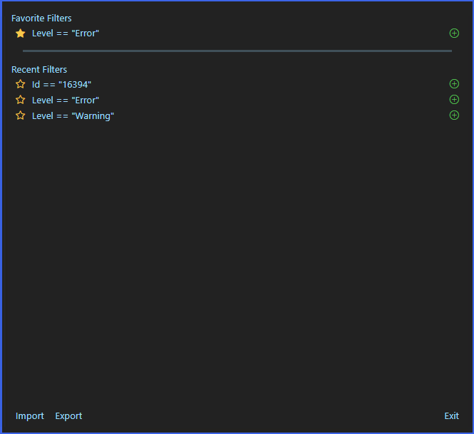
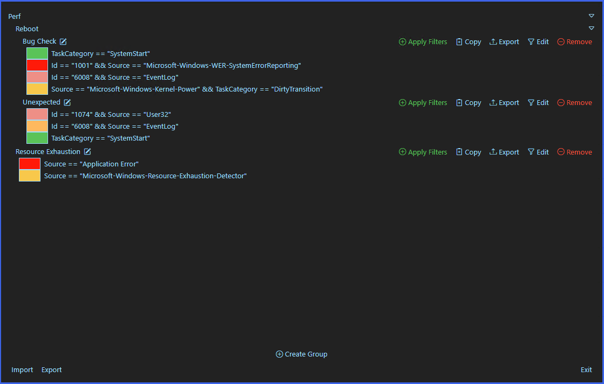

# [EventLogExpert](Home.md)

## Saved Filters

Two separate persisted surfaces, both reached from the `View` menu:

- `View` → `Show Cached Filters` opens the **filter cache** modal — a flat list of single-expression filter strings split into `Favorite Filters` and `Recent Filters` sections.
- `View` → `Show Filter Groups` opens the **filter groups** modal — named, structured collections of full filters (with categories, evaluators, comparison values, and per-filter highlight colors).

The two have different shapes and different intended uses. The cache is a one-string-per-entry shortcut for the comparison values you keep typing. Groups are reusable filter sets you assemble once and reapply or share.

### Filter cache (`Show Cached Filters`)

<!-- screenshot: filter-cache-modal --> 

**`Recent Filters`.** Every time a filter with a non-empty comparison value is added (basic, advanced, or exclusion), the comparison string is enqueued into the recent list. The list caps at 20 entries; older entries roll off. When the same string is added again it isn't re-added. Empty when no filter has been added yet (`No Recent Filters`).

**`Favorite Filters`.** A separately-tracked list with no size cap. Click the outline-star on a recent entry to promote it to favorites; click the filled-star on a favorite entry to demote it back to the recent list. Stars only ever copy a string into favorites — the recent entry is left in place; if the favorite is later un-starred, the same string ends up back in the recent queue.

**Apply.** The `+` button on any entry adds a new `Cached` filter row to the filter pane using that string as the value, then closes the modal.

**Import / Export.** The footer's `Import` and `Export` buttons read and write a JSON list of strings — only the favorites snapshot. Imported entries are merged into the existing favorites (no duplicates added).

The cache persists across app sessions in user preferences.

### Filter groups (`Show Filter Groups`)

<!-- screenshot: filter-groups-modal --> 

A filter group is a named collection of full filters — each with its own category / evaluator / comparison text / highlight color and any sub-filters. Groups can be organized into sections (the section name is the prefix before `\` in the group name, e.g. `Exchange\HUB Server` lives under section `Exchange` with display name `HUB Server`). Groups with no `\` in the name appear at the modal's top level.

Per-group buttons (when the group is not in edit mode):

| Button | Behavior |
| --- | --- |
| `Apply Filters` | Adds this group's filters to the current filter pane, skipping any whose comparison text + include/exclude flag already exists in the pane. Closes the modal afterwards. Existing pane filters are not touched. |
| `Copy` | Copies the group's filter expressions to the clipboard. With multiple filters, each is wrapped in parentheses and joined with the Dynamic LINQ OR operator so the result is a single Advanced expression you can paste back into the filter pane. |
| `Export` | Saves the entire group (name + filters) as a JSON file. |
| `Edit` | Switches the group into edit mode (per-row controls, `Add Filter`, `Save`, `Cancel`, `Import`, `Remove`). |
| `Remove` | Deletes the group. |

In edit mode each filter row gets the same chrome as the filter pane (toggle enable/exclusion, edit, save, remove); plus per-row highlight color picker. `Save` writes back when no row is mid-edit and no draft is unsaved.

The pencil icon next to the group name renames it. Empty names are rejected. The new name's `\` segment becomes the new section prefix.

`Create Group` at the bottom of the modal creates a new group named `New Filter Section\New Filter Group` (in section `New Filter Section`); rename it before saving filters into it. Group creation also seeds the `Save All Filters` flow on the `Edit` menu — that command prompts for a `Group Name` and saves the current filter rows as a new group with that name. Saved groups persist filter rows only; the date filter is stored separately and is not part of a group.

**Modal-level Import / Export.** The footer reads and writes JSON files containing the **entire** groups list. `Export` saves every group; `Import` reads a list of groups and adds them to whatever's already there (no merge by name, so re-importing the same file produces duplicates).

**Per-group `Export`** (button in the row's chrome) saves a single group as JSON. **Per-group `Import`** (in edit mode) replaces *this* group's name and filters with the contents of the picked file — useful for swapping the body of an existing group without creating a new one.

Filter groups persist across app sessions in user preferences.

### Cache vs. Groups: when to use which

- A single comparison string you keep retyping into the same one-field basic filter → cache it. Use `Add Cached Filter` from the filter pane and pick the value from the cache dropdown.
- A reusable set of filters that belongs together (e.g., "Exchange transport service errors") → make a group. Apply from the group row; share with `Export` / `Import`.

[Docs home](Home.md)
