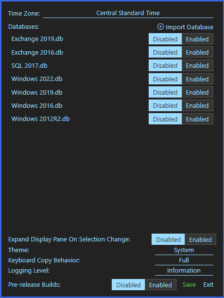

# [EventLogExpert](Home.md)

## Settings

`Tools` → `Settings` opens the Settings modal.

`Save` writes the form fields and any pending enable/disable toggles you've made on database rows; `Exit` discards them. `Import Database`, `Remove`, and `Upgrade` are immediate side effects — they run as soon as you click and persist regardless of `Save` / `Exit`.

<!-- screenshot: settings-modal --> 

### Time Zone

Drop-down of every system time zone. Event timestamps in the table, the Details pane, and the Date filter are all rendered in the selected zone. Changing this re-renders open logs in place; it doesn't reload them.

Set this to match the source machine, the customer's locale, or your own — whatever lines up most clearly with the events you're reading. Combined views from machines in different zones use this single zone for sorting and display.

### Databases

Lists every imported provider database with its current status and per-row controls (enable / disable, Upgrade when offered, Remove). The `Import Database` button opens a multi-file picker that accepts `.db` files and `.zip` archives containing them; conflicting filenames prompt to overwrite or skip.

A row badge shows the current state. While the initial pass is running, a `Classifying databases…` banner sits above the list:

| Badge | Meaning |
| --- | --- |
| (none) | `Ready` (loaded and usable) — or `Upgrade required`, in which case the row's `Upgrade` button replaces the badge as the visible affordance. |
| `Upgrade failed` | The most recent upgrade attempt failed; the row offers `Retry Upgrade`. Re-import or remove if the retry keeps failing. |
| `Recovery required` | A previous upgrade left a backup file in place; the original is still safe but needs reconciliation before the row goes back to `Ready`. |
| `Unrecognized` | The file isn't a database produced by this tool. |
| `Obsolete` | A v1 / v2 database from a long-superseded build of the tool; not upgradable in place — recreate with `eventdbtool create`. |
| `Classification failed` | Initial classification threw; details surface in `View Logs`. |

Closing the modal after enabling, disabling, or removing a database prompts to reload all open logs so resolution reflects the new set. See [Provider Databases](Provider-Databases.md) for the rationale and the `eventdbtool` CLI reference.

### Expand Display Pane On Selection Change

When `True`, the Details pane re-expands every time the selection changes, even if it was manually collapsed for the previous event. When `False`, a manual collapse stays collapsed until the pane is re-expanded by hand.

### Theme

`Follow System` (default), `Light`, or `Dark`. `Follow System` tracks the current Windows app-mode preference and switches with it.

### Keyboard Copy Behavior

Selects which copy format Ctrl+C uses on the event table:

| Value | Output |
| --- | --- |
| `Default` | One quoted, space-separated field per visible event-table column, plus the description. |
| `Simple` | Five quoted, space-separated fields: level, timestamp, source, event id, description. |
| `Xml` | The event's XML, pretty-printed when parseable. |
| `Full` | A multi-line block with labeled fields (`Log Name`, `Source`, `Date`, `Event ID`, `Task Category`, `Level`, `Keywords`, `User`, `Computer`, `Description`, `Event Xml`). |

The Edit menu always exposes all four formats explicitly (`Copy Selected`, `Copy Selected (Simple)`, `Copy Selected (XML)`, `Copy Selected (Full)`); the `Ctrl+C` shortcut hint moves to whichever entry matches the current setting. See [Keyboard and Copy](Keyboard-And-Copy.md).

### Logging Level

Controls the verbosity of the in-app debug log surfaced by `Help` → `View Logs`. Lower levels produce more rows and slow logging-heavy operations slightly; raise it before reproducing an issue you intend to report.

### Pre-release Builds

A footer toggle. When `True`, `Help` → `Check for Updates` includes pre-release GitHub releases as candidates. Stable releases are always considered regardless of this setting.

[Docs home](Home.md)
