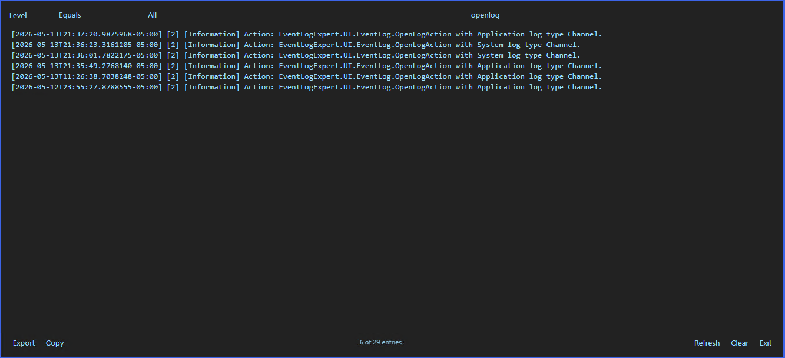

# [EventLogExpert](Home.md)

## Updates and Diagnostics

The `Help` menu hosts everything related to the build you're running and its diagnostic surface.

### Docs

Opens this docs site in the default browser.

### Submit an Issue

Opens the GitHub issue tracker in the default browser, with the new-issue form pre-selected. No data leaves the app — the form is blank, you fill it in.

### Check for Updates

Triggers an immediate check against the GitHub releases feed. Stable releases are always considered. When `Tools` → `Settings` → `Pre-release Builds` is enabled, pre-release tags are also considered.

The `Pre-release Builds` setting is persisted in user preferences and reused for the background update checks the app runs on its own — so it does not need to be re-enabled on every launch. When a `Check for Updates` (manual or background) reaches the GitHub feed and finds the running build's version published as a pre-release tag, the app title becomes `EventLogExpert (Preview) {version}` instead of `EventLogExpert {version}` so a preview install is visually distinct from a stable build at a glance. The same detection also auto-enables the `Pre-release Builds` setting on first occurrence (provided you hadn't explicitly toggled it before) so a manually-installed pre-release doesn't get prompted to "downgrade" to the next stable release. Both behaviors require a successful check to reach the feed — if the app launches offline, the title stays plain until the next successful check.

The check ends with one of four user-facing alerts:

| Alert | When it fires |
| --- | --- |
| `Update Available` | A newer applicable release was found. The alert offers to launch the installer. Fires on both user-initiated and background checks. |
| `No Updates Available` | The current build is already the newest applicable release. User-initiated checks only. |
| `Update Check Unavailable` | The running build is a development build (not a published release). User-initiated checks only. Body: `Update checks are disabled for development builds.` |
| `Update Failure` | Either (1) the releases feed could not be retrieved or parsed (network down, GitHub unreachable, malformed response) on a user-initiated check, or (2) the installer download, scheduling, or launch failed during an update install attempt. |

Background checks (the automatic check that runs on app start) surface `Update Available` so a fresh release is offered as soon as the app launches. The other three alerts are suppressed on background checks so a missing network at startup does not produce a popup. `Update Failure` does fire on a background check, but only after you've accepted the `Update Available` prompt and the resulting installer attempt fails; pre-prompt failures (e.g., feed unreachable, or you click `No` on the prompt and the queued-for-next-restart scheduling fails) stay silent and only land in the debug log.

Because the app already runs that background check on launch, the `Check for Updates` entry is mostly a manual "what's the latest right now" lookup; the app finds new releases on its own.

### Release Notes

Opens the Release Notes modal, which renders the markdown body of the published GitHub release for the running build. The modal needs a successful `Check for Updates` to have fetched and cached the running version's release notes; running `Check for Updates` once per session is enough — it caches the notes whether or not a newer release also exists. An alert titled `Release Notes Failure` appears when no successful check has run yet this session, or when the running version is not a published GitHub release (development builds, custom builds, or releases that have since been removed from the feed). Run `Check for Updates` first when in doubt.

### View Logs

Opens the Debug Log modal — the in-app view of the rolling diagnostic log written by the running session. The same log is also accessible as a file under the per-user app data directory; `View Logs` is the in-app surface.

<!-- screenshot: debug-log-modal -->

Filter bar:

| Control | Behavior |
| --- | --- |
| `Level` operator | `Equals`, `Not Equal`, or `Multi Select`. |
| `Level` value | Single dropdown when the operator is `Equals` or `Not Equal` (with `All` to disable the filter); multi-select dropdown when the operator is `Multi Select`. |
| `Filter messages...` | Free-text substring filter applied to the message column. Case-insensitive. |

Footer:

| Control | Behavior |
| --- | --- |
| `Export` | Saves the currently-filtered rows to a file (file dialog). |
| `Copy` | Copies the currently-filtered rows to the clipboard. |
| `{n} of {m} entries` | Live counter — filtered rows over total rows. |
| `Refresh` | Re-reads the on-disk log file. |
| `Clear` | Truncates the on-disk log file and the in-memory view. There is no confirmation. |

Set `Tools` → `Settings` → `Logging Level` to a more verbose value before reproducing an issue you intend to report; both `Export` and `Copy` honor whatever the filter bar is currently showing, so narrow to the relevant rows first.

[Docs home](Home.md)
