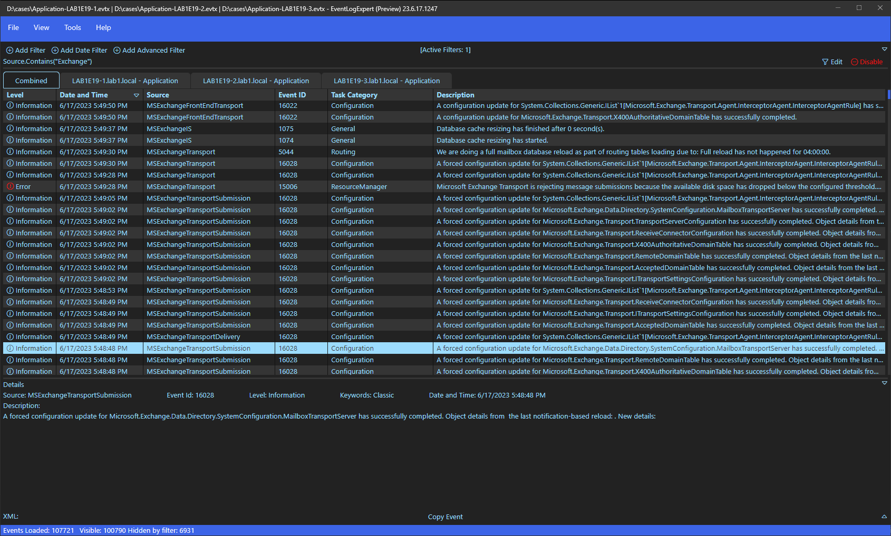

# [EventLogExpert](Home.md)

## Viewing Events

The main view has three regions: the **tab strip** (one tab per open log, plus a `Combined` tab when more than one log is open), the **event table**, and the **Details pane** (collapsible, bottom). The status bar runs along the very bottom — see [Opening Logs](Opening-Logs.md#live-log-behavior) for what it shows for live logs.

<!-- screenshot: main-view -->

### Tab strip

- One tab per open log. The tab label is the file name without extension for `.evtx` logs and `{LogName} - {ComputerName}` for live channels. The tab tooltip shows the full path / channel name. Tabs that finished loading with zero rows are prefixed `(Empty)`; tabs still loading show a spinner next to the label.
- A `Combined` tab appears when two or more logs are open. It shows every event from every open log interleaved by time and rendered in the configured time zone.
- Click a tab to switch to it. The `×` on each per-log tab closes just that log; `Combined` has no close button and disappears on its own when the open-log count drops below two.

### Event table

The table is virtualized — only the rows currently in view are rendered, so loading large `.evtx` files stays responsive.

See [Performance](Performance.md) for how the virtualized table, the segmented sorted store, and streaming resolution keep very large logs fast to open and scroll.

**Configurable columns.** Right-click a column header to open the column menu:

- A toggle per column (checked = visible). The available columns are `Level`, `Date and Time`, `Activity ID`, `Log`, `Computer Name`, `Source`, `Event ID`, `Task Category`, `Keywords`, `Process ID`, `Thread ID`, and `User`. The `Description` column is fixed and always rightmost.
- An `Order By` submenu pinned to the same set of columns, with `(default)` at the top. The checked item is the current sort key; `(default)` clears a custom sort and returns to the default order. Re-picking the column you are already sorted by does nothing - clearing the sort is always explicit (the `(default)` item or the status-bar chip's `×`).
- A `Group By` submenu pinned to the groupable columns, with `(none)` at the top - see [Grouping](#grouping).
- `Reset Column Defaults` restores the default column visibility, order, and widths. A custom sort is left in place; grouping is kept unless restoring the defaults hides the grouped column (for example `Activity ID`), which turns grouping off.

The sorted column header shows a caret; click it (or press Enter or Space while it is focused) to flip between ascending and descending. A `Sorted by {column}` chip also appears in the status bar - its caret flips the direction and its `×` clears the sort back to the default order. Screen readers announce each change (for example, "Sorted by Source, ascending" or "Sort cleared, showing default order").

The `User` column shows the best-available account identity, resolved offline (no directory lookup): a well-known-SID name (e.g. `NT AUTHORITY\SYSTEM`), otherwise the acting or target account carried in the event's data (`DOMAIN\user`), otherwise the raw SID, and blank only when the event carries no user identity at all. Sorting, grouping, and cell-filtering on `User` all use this displayed name.

**Column reordering.** Drag a column header sideways to drop it before or after another column. The new order persists across sessions until `Reset Column Defaults` (in the column menu) restores it.

**Column sizing.** Drag a column-header edge to resize. Sizes persist across sessions; `Reset Column Defaults` restores the built-in widths along with column visibility and order.

**Per-row highlighting.** When a filter has a `Highlight Color` set, every event matching that filter is rendered with that background color. The configured colors live alongside the filter — see [Filtering](Filtering.md). When several enabled, non-excluded filters could highlight the same row, the first one in pane order wins.

**Selection.** Click to select. Ctrl+Click toggles individual rows. Shift+Click selects a range from the anchor to the clicked row. Ctrl+Shift+Click extends the selection additively from the anchor to the clicked row without dropping rows you've already selected elsewhere. Arrow keys, Page Up / Page Down, Home, and End move within the table; Shift + those keys extends the selection. `Ctrl+A` selects every event in the table (including events hidden inside collapsed groups — see [Grouping](#grouping)); `Escape` clears the selection. The selection drives both the `Ctrl+C` clipboard copy (see [Keyboard and Copy](Keyboard-And-Copy.md)) and the Details pane.

**Right-click on a row.** Opens a context menu:

- `Copy Selected` / `Copy Selected (Simple)` / `Copy Selected (XML)` / `Copy Selected (Full)` — same four formats as the `Edit` menu.
- `Exclude Events Before` / `Exclude Events After` — sets a date filter using the right-clicked event's timestamp as the boundary.
- `Group by <column>` - groups by the right-clicked cell's column when that column is groupable; the same item reads `Remove grouping by <column>` when you right-click a cell in the column you are already grouped by. For a cell that is not groupable (or a keyboard-invoked row menu), a `Group By` submenu is offered instead.
- `Include` and `Exclude` submenus — each lists the field comparisons applicable to a single right-clicked event; a field is enabled only when the event carries a value for it (otherwise it is shown disabled with a reason). Picking an enabled one creates a new basic filter (or exclusion) for that field equal to the right-clicked event's value. `Description`, `Xml`, and the advanced-only `User ID` are not offered; the fields that can produce a filter are `Event ID`, `Activity ID`, `Level`, `Keywords`, `Source`, `Task Category`, `Process ID`, `Thread ID`, `User` (the resolved account name, or the raw SID when that is all the event carries), and `Log Name`.

### Grouping

Group the table by any column except `Description`, `Record ID`, and `Date and Time` so related events fold under a shared header row. Grouping is most useful for an identifier such as `Activity ID`, but works for every column in the `Group By` submenu.

**Turning grouping on.** Pick a column from the `Group By` submenu on a column-header right-click, or use the direct `Group by <column>` item on a groupable cell. Groups are ordered by the grouped value, and events within each group keep the current `Order By` sort. Each header row shows the column name, the group value (or `(none)` when that value is empty), and the event count - for example `Activity ID: {guid} (42)`. The grouped column's header gains a second indicator (a double-chevron) alongside any sort caret, and a `Grouped by {column}` chip appears in the status bar. Screen readers announce the change (for example, "Grouped by Activity ID, ascending").

**Group direction.** Flip the order of the groups themselves (ascending or descending) from any of three places: the double-chevron indicator on the grouped column header, the caret on the status-bar `Grouped by {column}` chip, or `Group Descending` on the `View` menu. This is independent of the per-event `Order By` direction.

**Turning grouping off.** Use the `×` on the status-bar `Grouped by {column}` chip, `Remove grouping by <column>` on the group header's (or the grouped cell's) right-click menu, or `Group By -> (none)` on the column menu. Screen readers announce "Grouping cleared".

**Expanding and collapsing.**

- Click a group header, click its chevron, or press `Enter` while the header is focused to toggle that one group. `ArrowLeft` / `ArrowRight` also collapse / expand a focused header — see [Keyboard and Copy](Keyboard-And-Copy.md#grouped-event-table).
- `Expand All Groups` and `Collapse All Groups` are on both the group header's right-click menu and the `View` menu.
- Collapse state is **transient**: it is not persisted and resets whenever you switch to a different log tab.

**Selecting a group.** Right-click a group header and choose `Select Group` to select every event in that group, including events hidden by a collapse. `Ctrl+A` still selects every event in the table, also including those inside collapsed groups.

### Details pane

The Details pane sits at the bottom of the window. It hides itself when no event is selected. The header expand/collapse arrow toggles the pane between expanded and collapsed (the arrow's accessible name is `Details Expanded` / `Details Collapsed`); behavior on selection-change is governed by `Tools` → `Settings` → `Expand Display Pane On Selection Change`.

The top of the pane shows the same fields as a Windows Event Viewer details view: `Log Name`, `Source`, `Event Id`, `Level`, `Keywords` (only when present), and `Date and Time`. Below those, the `Description` paragraph is the resolved event description text (the same text the table previews in the `Description` column).

Below the description, an `XML` toggle (accessible name `XML Expanded` / `XML Collapsed`) expands the raw event XML. The XML is resolved on demand the first time the toggle is opened for a given event — the placeholder text is `Resolving XML...` until resolution completes. Events with no XML available render `No XML available for this event.`.

The pane can be resized vertically by dragging the splitter at the top.

[Docs home](Home.md)
